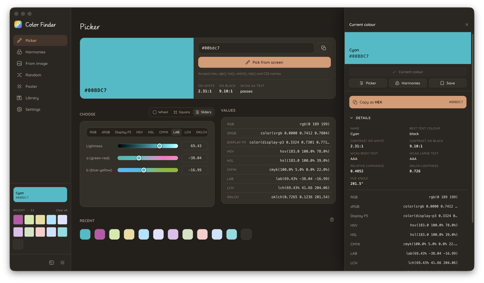
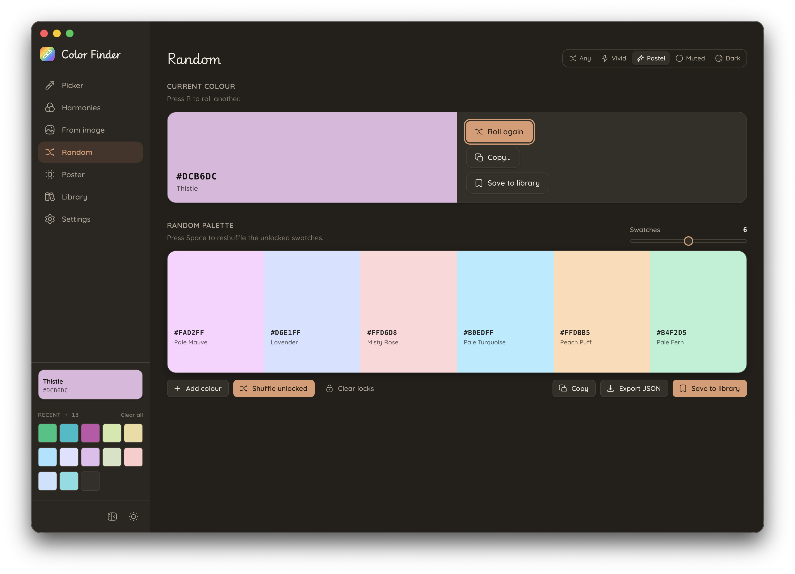
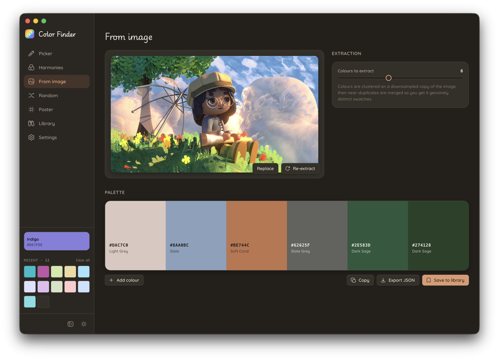
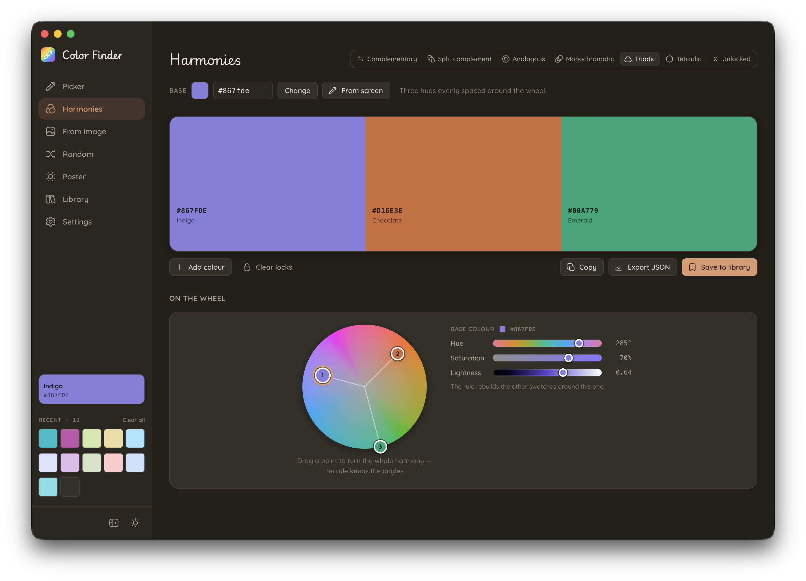
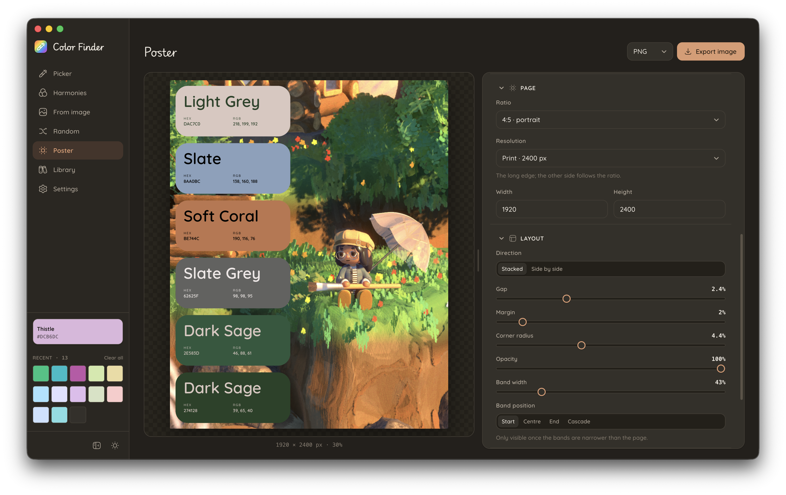
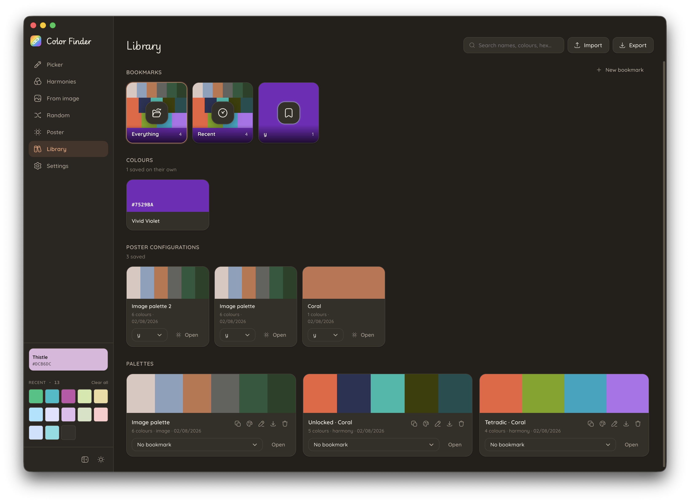

# Color Finder

A cosy desktop colour picker, palette generator and library. React + TypeScript inside
Electron; everything runs locally and nothing is sent anywhere.

```bash
npm install
npm run dev
```

Other scripts: `npm run typecheck`, `npm run build`, `npm run icon`,
`npm run dist:mac|dist:win|dist:linux`.

> `npm install` does not always fetch the Electron binary itself. If `npm run dev` fails
> with `Error: Electron uninstall`, run `node node_modules/electron/install.js` once.

## Features by Page

### Picker

Pick any colour from your screen with pixel-perfect precision. The interactive picker displays a live preview with **saturation and lightness controls**, **hue slider**, and multiple **colour space options** (HEX, RGB, sRGB, Display P3, HSV, HSL, CMYK, LAB, LCH, OKLCH). Use the **pick from screen** button to capture colours directly from your screen with cross-platform support for macOS, Windows, and Linux. Recently used colours are displayed in the sidebar footer for quick access. The right panel shows detailed colour information and supports copying in your preferred format.



### Random

Create random colour palettes. Use multiple **flavours** (Any, Vivid, Pastel, Muted, Dark) to match your mood. Shuffle individual colours or regenerate the entire palette instantly. Save your favourite random combinations to your library. The "Roll again" button lets you iterate quickly until you find the perfect palette.



### From Image

Extract colour palettes directly from images. Upload an image and let the app generate a palette. Adjust the number of colours to extract and re-extract as needed.



### Harmonies

A dedicated page for advanced harmony editing using a **polar interface**. The **polar harmony wheel** shows OKLCH hue around the rim and chroma along the radius, giving you a precise visual representation of harmonic relationships. Choose from harmonic rules (Complementary, Split complement, Analogous, Monochromatic, Triadic, Tetradic, Unlocked) and watch the wheel update in real time.

Drag points on the wheel to adjust colours while maintaining harmony relationships under a rule, or switch to "Unlocked" for individual control. Separate sliders control **hue**, **saturation**, and **lightness** of the base colour—when applied to a rule, all swatches update in lockstep while preserving their spacing. Lock swatches you like, shuffle the rest, and regenerate freely.



### Poster

Export palettes as beautifully designed colour cards. Choose from **6 templates** (Spec sheet, City lights, Retro, Columns, Cards, Minimal), each with distinct layouts. The preview on the left shows exactly what you'll export—no surprises. Fully customizable on the right:

- **Layout**: portrait, square, landscape, A4, or free aspect ratio
- **Resolution**: from 900px to 3600px for print-quality output
- **Bands**: stacked or side-by-side with adjustable gap, margin, corner radius, opacity, and band width
- **Text**: fully styled typography with typeface, weight, sizes, tracking, alignment and position control
- **Colours**: solid backgrounds, palette gradients, or images with pan, zoom, and blur
- **Values**: choose which formats to display (HEX, RGB, HSL, CMYK, OKLCH, index) and their layout

Save entire poster configurations to your library and reuse them instantly. Export as PNG, JPEG, or WebP.



### Library

A comprehensive repository for all your saved content, organized into distinct sections:

- **Bookmarks**: flat folders for organizing palettes, colors and posters. Each bookmark card shows a grid of palette thumbnails (one row per palette) with the bookmark's glyph on a coloured plate.
- **Colours**: standalone colours you've saved individually, displayed as swatches with names and hex values.
- **Poster configurations**: saved poster templates you've created, ready to open and re-edit with a quick **Open** button.
- **Palettes**: your full palette collection displayed as strips of swatches with names, generation method, save date, and bookmark assignment. Click to edit in-place (all changes write through to storage immediately) or open controls to copy, export as JSON, or save again.



## For Implementation Details

See [ARCHITECTURE.md](ARCHITECTURE.md) for deep dives on component structure, the cross-platform screen picker, harmony wheel mathematics, poster rendering pipeline, colour handling, data persistence, and design decisions.
